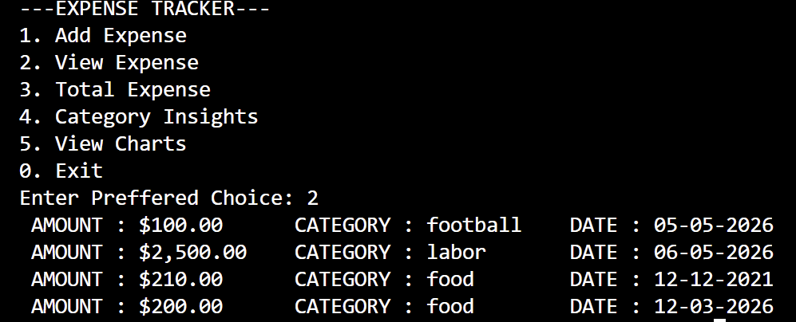
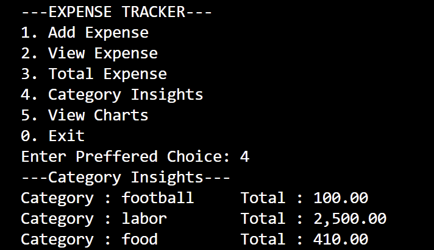
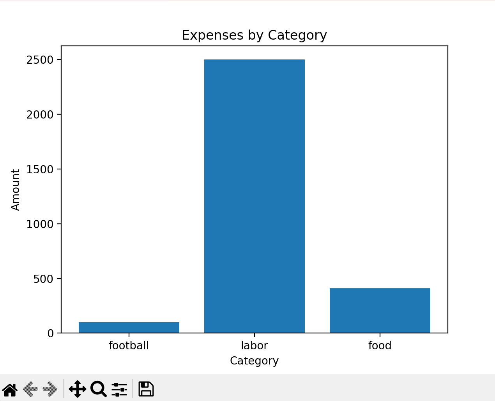

# Expense Tracker CLI

A Python-based CLI application to track, analyze, and visualize personal expenses.

## Features
- Add and store expenses (CSV-based)
- View formatted expense history
- Calculate total spending
- Category-wise insights
- Data visualization using matplotlib

## Tech Stack
- Python
- CSV file handling
- Matplotlib

## How to Run
```bash
python app.py




